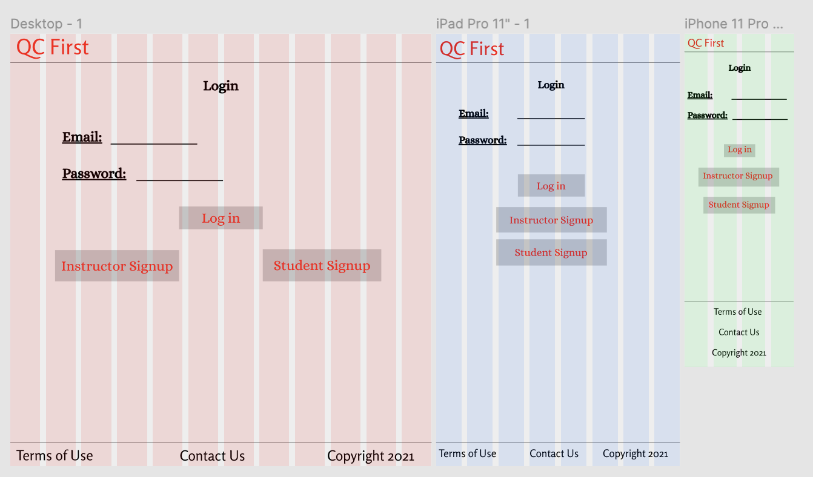
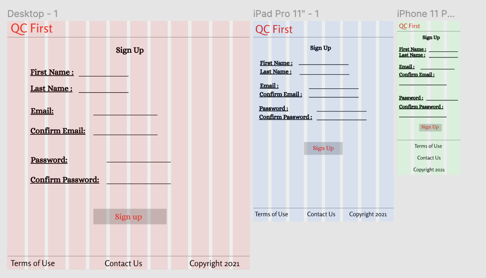
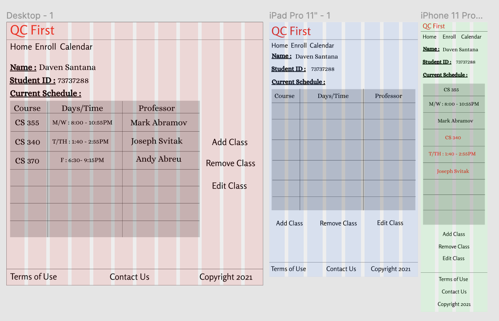
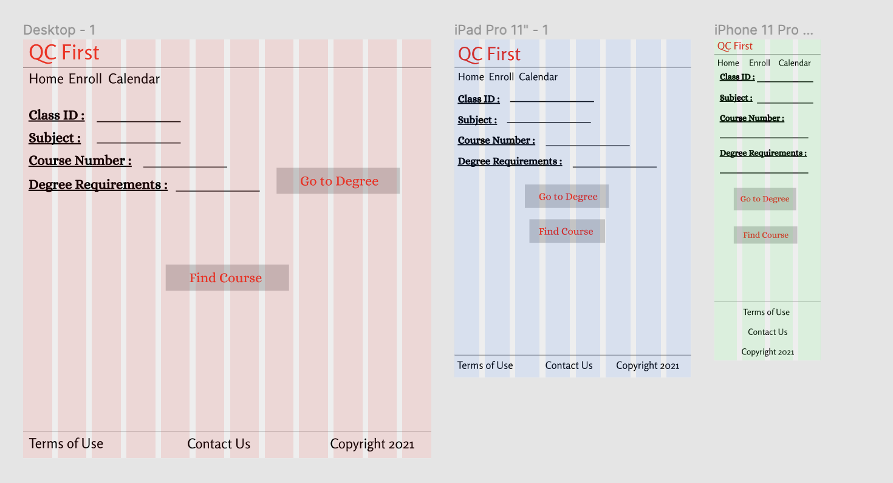
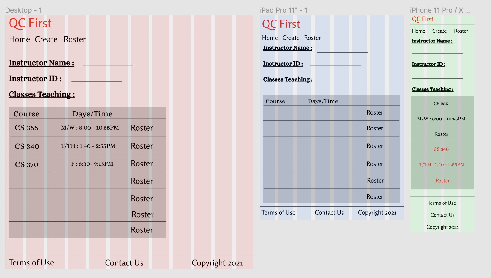
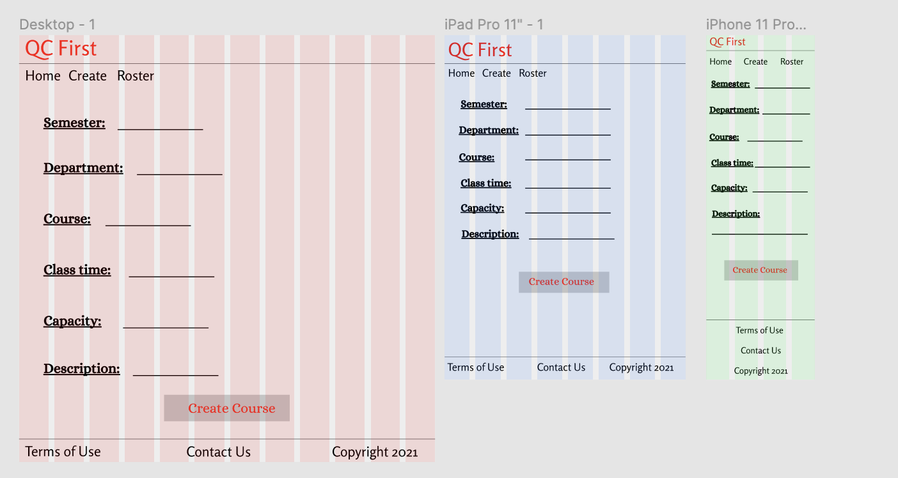
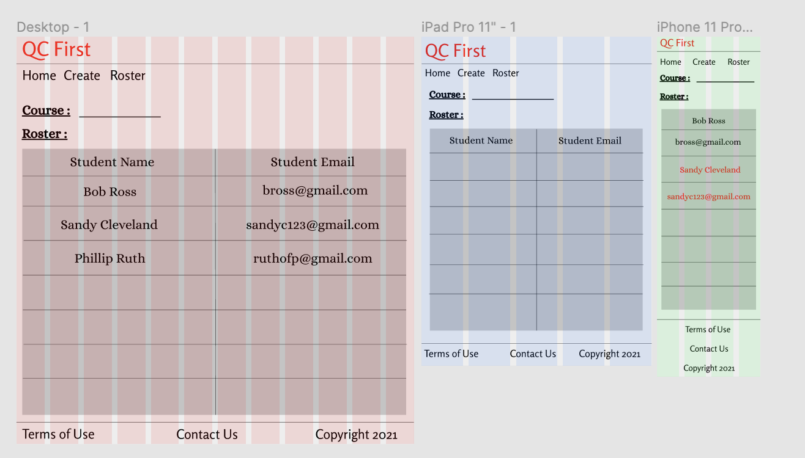

# QCFirst

## Link to website: https://born2code1999.github.io/qcfirstCode/index.html

## Students know which classes to enroll in by using the "Go to degree requirements" feature. Here, they will see the courses required for their specific degree.

## Responsive Login Page
### Users will land on the login page when they visit QCFirst. Login credentials will determine instructor or student.

## Sign Up Page
### If user does not have an account, this is where they will create it

## Student Home
### This is where students see their class schedule and can navigate to add or remove class

## Student Enroll
### Student's can enroll in courses here

## Instructor Home
### Instructors can view the courses they are teaching

## Instructor Create
### Instructors can add classes they want to teach for the semester

## Instructor Roster
### Instructor can view the student roster's for the courses they are teaching

