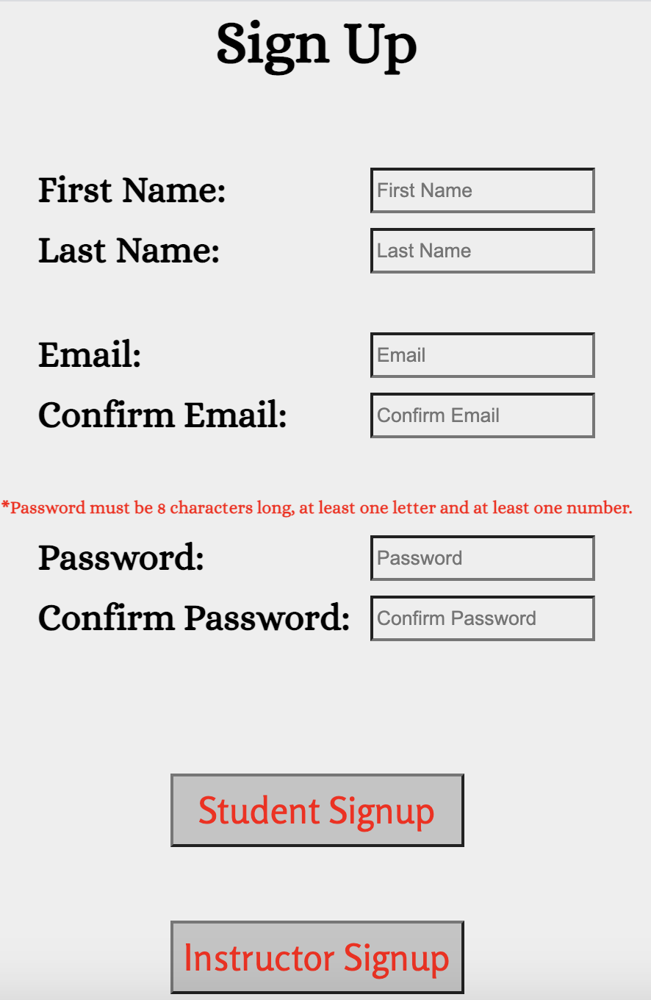

# QCFirst

## Project Information

The point of this project is to recreate Queens College's CUNYFirst site which is used for Students to enroll into courses and contains more information like their transcript and more. Professors are also able to use CUNYFirst to create courses for students to enroll in. CUNYFirst is not the best site to use since it is very inefficient so this an attempt to improve on a bad site design.

## Link to application

The live application is hosted by Repl.it with link :
https://replit.com/@Born2Code1999/qcfirst-4

The application code is posted on GitHub with link : https://github.com/Born2Code1999/qcfirst

## Team Members

  - Daven Santana
  - Tajirian Islam

## Contributers

  - Daven Santana - Coded parts of HTML and mostly CSS, worked on the design of the pages, coded the backend and connected everything from frontend to backend and also tested project features.
    - https://davensantana.github.io/
  - Tajirian Islam - Coded most of the HTML and helped coding the CSS styles also helped create the design for each page, helped coding the backend and connecting the frontend to backend, tested features to make sure everything worked as it was supposed to.
    - https://born2code1999.github.io/

## Features

  - Login and Signup Features 
    - Users will be notified for invalid login information.
    - Users will be notified for specific signup errors such as invalid email, email already exists as an account, invalid password, passwords don't match and so on.

  - Student Features
    - Students have the ability to enroll into classes and can search up classes in many different ways. If a student just knows the class name they can use this in the search bar. If a student knows the course ID they can use the course ID. If a student wants to search for a specific class they can use the course department and course name drop down to find it. Finally if a student wants to see all possible courses they can enroll in, they can leave everything empty and it will give all possible courses. https://qcfirst-4.born2code1999.repl.co/studentenroll
    - When students are adding a course they will be notified if they already added this specific course, already added a course of this type meaning they cannot have two CSCI 111 courses or if there is a time conflict with their schedule when adding this course. https://qcfirst-4.born2code1999.repl.co/studentcourses
    - Students have the ability to also look up the requirements for their degree, they can choose their major from the drop down and click the degree requirements button to go to a page with the degree requirements. https://qcfirst-4.born2code1999.repl.co/studentenroll
    - Students can also drop courses by going to the drop course page and selecting the course they want to drop, this will remove it from their schedule and remove the student from the course which opens up another spot in the course. https://qcfirst-4.born2code1999.repl.co/studentdrop

  - Instructor Features
    - Instructors can create courses through using drop downs with specific information on possible ways to create a course such as possible semesters, departments, courses in that department, class days and class time. Instructors can use their own custom capacity and their own custom course description. After creating the course, the instructor can view it on their home page and can also delete the course instantly. Instructors will be notified if something went wrong when creating the course such as missing a certain field or if there is a time conflict with another course. https://qcfirst-4.born2code1999.repl.co/instructorcreate
    - Instructors can also view the roster for each course they have, they select the specific course from the drop down containing all their courses and then click the "Find Roster" button to see the students names and emails of students in that course. https://qcfirst-4.born2code1999.repl.co/instructorroster
    - Instructors have the ability to delete courses, this means if they no longer want to teach that course they can delete the course from their schedule and it will automatically remove all the students from that course, and will not allow for any more students to try and join the course. https://qcfirst-4.born2code1999.repl.co/instructordelete

  - Admin Features
    - Admin's have the ability to view all of the tables inside of the database, this is the student database, instructor database, course database and the search database which contains the searches for specific students. Admin's can click the button on which specific database they want to view and the information will be given to them in a table. When clicking the student database they see what courses the students are enrolled, the instructor database will show the courses the instructor is teaching and the course database will show the students enrolled in that specific course. https://qcfirst-4.born2code1999.repl.co/adminhome

## Front-end / Client-Side Technologies

For the front end we decided to use HTML and ejs files in order for the user to see specific information. HTML pages were used only for the studentenroll and instructor create pages since these contained static information. For all the other pages we used ejs to render information because all the information rendered on these pages were given to us by the backend and we had to serve the data to the front end so the users could see specific information. ejs files we figured were good to use since they work the same exact way as HTML files except for some minor tweaks to serve database information.

## Back-end / Server-Side Technologies

For the backend we decided to use Node.js and it's libraries and decided to use express for our live server since we already had experience using express prior.

## Database Management System

For the DBMS we decided to use MongoDB and Mongoose as the way to access to create information inside of the database. 

## Original Designs Made on Figma

### Responsive Login Page
Users will land on the login page when they visit QCFirst. Login credentials will determine instructor or student.

### Sign Up Page
If user does not have an account, this is where they will create it

### Student Home
This is where students see their class schedule and can navigate to add or remove class

### Student Enroll
Student's can enroll in courses here
  - Students know which classes to enroll in by using the "Go to degree requirements" feature. Here, they will see the courses required for their specific degree.

### Instructor Home
Instructors can view the courses they are teaching

### Instructor Create
Instructors can add classes they want to teach for the semester

### Instructor Roster
Instructor can view the student roster's for the courses they are teaching

## Final Designs

### Responsive Login Page
Users will land on the login page when they visit QCFirst. A user will click the student login, instructor login or admin login depending on what type of account they have when they created it. There is also a signup button in order for the user to signup if they need to create an account.

### Sign Up Page
If user does not have an account, this is where they will create it, a user must meet specific requirements when creating an account, the email must be a real email, the password must be 8 characters long and include and at least one letter and one number.

### Student Home
This is where students see their class schedule and can navigate to add or remove class. The home page contains the students name and ID and also a table with the information about the students courses. This page also allows for a student to change through tabs where they can add a course or drop a course.

### Student Enroll
Student's can enroll in courses here, they can use the search bar to search for classes with specific things similar in their name, for example, 111 will match all 111 courses. A user can decide to either search by a specific course or search by course ID if the course ID is known. If a user decides they want to view all possible courses they can join they can click search for course while having nothing filled in.
  - Students know which classes to enroll in by using the "Go to degree requirements" feature. Here, they will see the courses required for their specific degree.

### Student Course 
This is the page that shows the student all the courses that meet their specific requirements given by the enroll page. Here the student can view the course ID, course name, course time, professor, semester, a description of course, the deadline and the capacity. Students can decide to add the course if they want to by clicking on the "Add Course" button which is to the right of each course.

### Student Drop 
Here student's have the ability to drop courses if they don't want the course anymore or for any other reasons. The course ID is shown and the course name to guarantee you are dropping the correct course and there is a "Drop Course" button to the right which a user clicks when they want to get rid of that specific course. 

### Instructor Home
Instructors can use this page to view their name and ID and also to view the courses they are teaching. This is also the landing page for instructors so they can use this page to navigate to other pages they have access to such as create where they can create a course, roster to check the course rosters and the delete page where they can delete courses.

### Instructor Create
Instructors can add classes they want to teach for the semester, the instructor will enter all the specific information they want for the course and the course will be created which allows for students to be able to join.

### Instructor Roster
Instructor can view the student roster's for the courses they are teaching, they can switch in between courses by clicking the drop down and selecting the specific class roster they want to view and then by hitting the "Find Roster" button. 

### Instructor Delete
An instructor has the ability to delete courses as well. This page shows the instructor the course ID, course name and course time to make sure that the instructor is deleting the right course that they want to delete. They can delete the course by pressing the "Delete Course" button.
 
### Admin Home
The admin home page is the landing page for admins and on this page an admin is able to view the student database, instructor database, course database and the search database (Containing searches that students make). The have the ability to view these databases just by clicking the button of the specific database they want to view.

## Differences between first design and final design

  - For the login page the buttons were originally in different positions, there was one login button and there was two signup buttons. Instead of only one login button we added three login buttons depending on what type of account the user has, if they are an instructor they use the instructor button to login. We removed one of the signup buttons and only made it one signup button.

  - For the signup page there was also a small change of making two signup buttons, one for instructor and one for students and a third button that allowed you to go back to the login page if you accidently clicked sign up or just landed on the signup page instead of the login page. We also stacked everything in one column for the mobile page since it would just work better in one column.

  - For the student home page we moved the buttons from the right on desktop to under the table and for the table on mobile we made it so the data fits in all three columns instead of one long column. For mobile it just allows the page to be viewed more easily, we didn't do a drop down since it may be annoying to click something to show more information for every single part of the list. The table was also expanded to hold more information such as the course ID and the semester. We also removed the edit class button since you could just add or drop a class instead of editing it. 

  - For the student enroll page we added a search bar due to it being a new requirement but again for mobile we just stacked everything into one column.

  - We also created a new student courses page which is the page that shows up with  all the courses the student is looking for. For this page we used multiple tables with multiple columns with different information in each column, again we used multiple columns on mobile since we didn't want to have to expand it every time you wanted to see more information about a course. The table is responsive and gets smaller as the screen gets smaller so the columns don't appear of the page ever.

- Another student drop page was also created as well. This page contains a table with 4 columns, course ID, course name, course time and a button to drop that specific course. This page was made in order to create a new feature which was not a requirement but something which is probably very much needed since you don't want to be stuck with a course forever unless the instructor deletes the course.

  - For the instructor home page we removed the third column which was a roster button since you could just click the button in the nav bar to get to the roster so it made it redundant. Instead we added some new columns which contain the class ID and the semester of when the course will be occurring, the other columns are the same. We also made the table appear in four columns instead of one since again it just shows all the information at once and you don't have to expand it to see more information.

  - For the instructor create page everything stayed about the same just that we made everything a single column on mobile.

  - For the instructor roster page everything also stayed the same here except for mobile where we kept the information in two columns instead of one since again you don't have to expand every single column to get more information.

  - We also had to create a new instructor delete page to fulfill the requirement of instructors being able to delete courses, this table is the same exact one as the student drop table since it's a simple table with all the information needed to know before dropping a course.

  - The last thing we added was an admin page. The admin page is just a page with 4 different buttons that allow the admin to view all the information inside of the database. The buttons have different tables to show every time they are pressed since some databases may contain more information than others.

